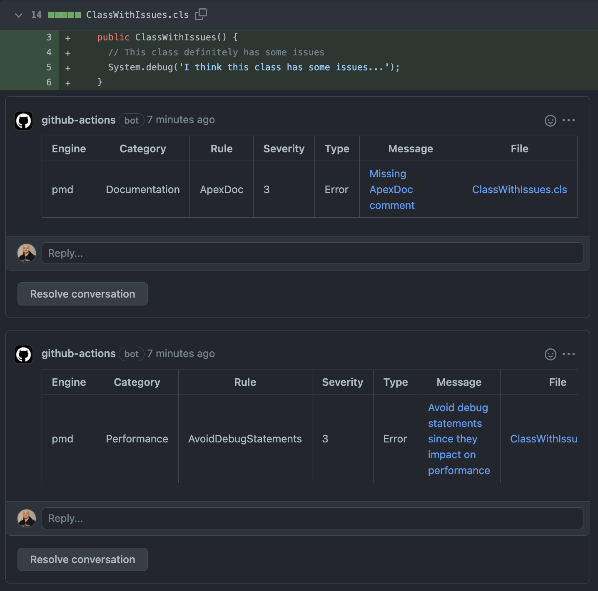

# sfdx-scan-pull-request

Runs sfdx-scanner on a pull request or individual commit and generates in-line comments with the findings.



## Inputs

| NOTE: All inputs are optional |
| ----------------------------- |

## `category`

Categor(ies) of rules to run.

## `engine`

Engine(s) to run. This takes the form of a comma delimited string, and is passed directly to the sf scanner command line. ie:

```
'pmd,eslint,eslint-lwc'
```

## `eslint-env`

JSON-formatted string, overrides ESLint's default environment variables.

## `eslintconfig`

Location of eslintrc config to customize eslint engine.

## `pmdconfig`

Location of PMD rule reference XML file to customize rule selection.

### Multiple PMD Rulesets

To use multiple rulesets within the scan, make a top level file such as `masterRuleset.xml` and include the paths to the other ruleset files:

```
.
├── masterRuleset.xml
├── ruleset1.xml
└── ruleset2.xml
```

```xml
<?xml version="1.0" encoding="UTF-8"?>
<ruleset name="master"
    xmlns="http://pmd.sourceforge.net/ruleset/2.0.0"
    xmlns:xsi="http://www.w3.org/2001/XMLSchema-instance"
    xsi:schemaLocation="http://pmd.sourceforge.net/ruleset/2.0.0 https://pmd.sourceforge.io/ruleset_2_0_0.xsd">
    <description>Master Ruleset</description>
    <rule ref="ruleset1.xml" />
    <rule ref="ruleset2.xml" />
</ruleset>
```

```yml
pmdconfig: masterRuleset.xml
```

## `custom-pmd-rules`

A JSON string which defines any custom rules which need to be registered before the scan is ran. Custom rules are identified by the path to their XML/JAR file and their language.

ex:

```json
[
  { "path": "customRules/customApex.jar", "language": "apex" },
  { "path": "customRules/customXml.xml", "language": "xml" }
]
```

## `severity-threshold`

Throws an error when violations of specific severity (or more severe) are detected.

## `strictly-enforced-rules`

A JSON string which defines the rules which will be strictly enforced regardless of their priority. Enforced rules are identified by their engine, category, and rule name.

ex:

```json
[{ "engine": "pmd", "category": "Performance", "rule": "AvoidDebugStatements" }]
```

## `target`

Optionally provide this to scan a whole directory instead of just the diff. If the action is run on a push, `target` will be respected; because GitHub does not allow the uploading of comments during a PR run for a file that hasn't been changed on the latest commit for that PR, this option is ignored when running for a pull request (in favor of just scanning the diff, as it would if this option wasn't supplied).

## `tsconfig`

Location of tsconfig.json file.

## `report-mode`

Details which way to report issues back to GitHub, can be either:

- `check-runs` - Shows findings as annotations on the PR (default)
- `comments` - Shows findings as comments

## `delete-resolved-comments`

When set to true, will delete resolved comments from a PR. Defaults to `false`. Will do nothing unless `report-mode` is set to `comments`.

## Example usage

```
name: Static Analysis
on:
  pull_request:
    types: [opened, reopened, synchronize]
  workflow_dispatch:
jobs:
  analyze:
    runs-on: ubuntu-latest
    steps:
      - uses: actions/checkout@v3
        with:
          fetch-depth: 0

      - name: Install SFDX CLI and Scanner
        run: |
          npm install sfdx-cli -g
          sfdx plugins:install @salesforce/sfdx-scanner

      - name: Run SFDX Scanner - Report findings as comments
        uses: mitchspano/sfdx-scan-pull-request@v[LATEST_VERSION_HERE]
        with:
          pmdconfig: masterRuleset.xml
          severity-threshold: 4
          strictly-enforced-rules: '[{ "engine": "pmd", "category": "Performance", "rule": "AvoidDebugStatements" }]'
        env:
          GITHUB_TOKEN: ${{ secrets.GITHUB_TOKEN }}
```

Note the global installation of the SFDX cli - alternatively, you can use:

```
- name: Install SFDX CLI and Scanner
  run: |
    npm install sfdx-cli
    npx sfdx plugins:install @salesforce/sfdx-scanner
```

for that step.

### Included Dependencies

This package includes the following version of the required dependencies:

| npm package     | included version |
| --------------- | ---------------- |
| @actions/core   | 1.9.0            |
| @actions/github | 5.0.3            |
| @octokit/action | 4.0.4            |
| parse-diff      | 0.9.0            |

 <!-- @salesforce/sfdx-scanner (sfdx-cli plugin) 2.13.7            -->

### Making Modifications

To make modifications to this project, be sure to run the following command before raising a pull request:

```
npm run build
```

This will use [ncc](https://github.com/vercel/ncc) to bundle the contents of the project and `node_modules` into the `dist` folder.

For more information regarding the inclusion of these static versioned dependencies and the necessity of the `build` command, check out this [documentation](https://docs.github.com/en/actions/creating-actions/creating-a-javascript-action#commit-tag-and-push-your-action-to-github)
