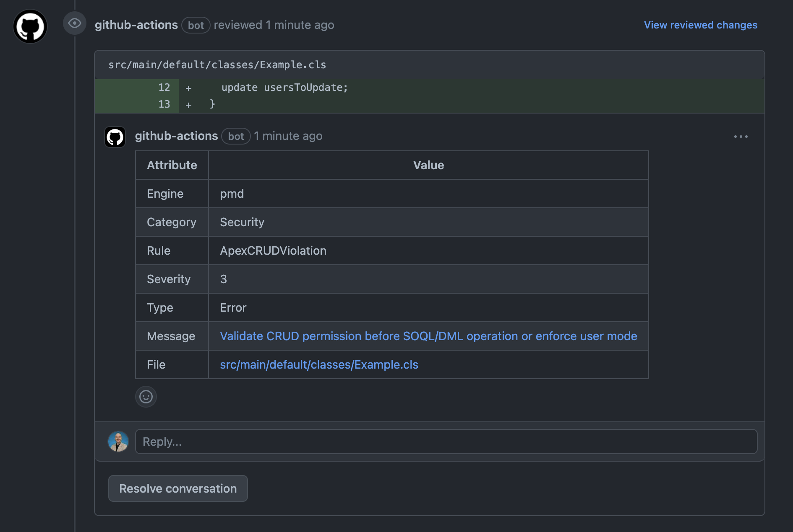

# sfdx-scan-pull-request

Runs sfdx-scanner on a pull request and generates in-line comments with the findings.



## Inputs

## `category`

Categor(ies) of rules to run.

## `engine`

Engine(s) to run.

## `eslint-env`

JSON-formatted string, overrides ESLint's default environment variables.

## `eslintconfig`

Location of eslintrc config to customize eslint engine.

## `pmdconfig`

Location of PMD rule reference XML file to customize rule selection

## `severity-threshold`

Throws an error when violations of specific severity (or more severe) are detected.

## `strictly-enforced-rules`

A JSON string which contains the rules which will be strictly enforced regardless of their priority. Enforced rules are identified by their engine, category, and rule name.

## `tsconfig`

Location of tsconfig.json file

## Example usage

```
name: Static Analysis
on:
  pull_request:
    types: [opened, reopened, synchronize]
  workflow_dispatch:
jobs:
  analyze:
    runs-on: ubuntu-latest
    steps:
      - uses: actions/checkout@v3
        with:
          fetch-depth: 0
      - name: Install SFDX CLI and Scanner
        run: |
          npm install sfdx-cli
          node_modules/sfdx-cli/bin/run plugins:install @salesforce/sfdx-scanner
      - name: Run SFDX Scanner - Report findings as comments
        uses: mitchspano/sfdx-scan-pull-request@v0.1.6
        with:
          pmdconfig: ruleset.xml
          severity-threshold: 4
          strictly-enforced-rules: '[{ "engine": "pmd", "category": "Performance", "rule": "AvoidDebugStatements" }]'
        env:
          GITHUB_TOKEN: ${{ secrets.GITHUB_TOKEN }}
```

### Included Dependencies

This package includes the following version of the required dependencies:

| npm package     | included version |
| --------------- | ---------------- |
| @actions/core   | 1.9.0            |
| @actions/github | 5.0.3            |
| @octokit/action | 4.0.4            |
| parse-diff      | 0.9.0            |
| recursive-copy  | 2.0.14           |
| sfdx-cli        | 7.161.0          |

 <!-- @salesforce/sfdx-scanner (sfdx-cli plugin) 2.13.7            -->

For more information regarding the inclusion of these static versioned dependencies, see [here](https://docs.github.com/en/actions/creating-actions/creating-a-javascript-action#commit-tag-and-push-your-action-to-github)
